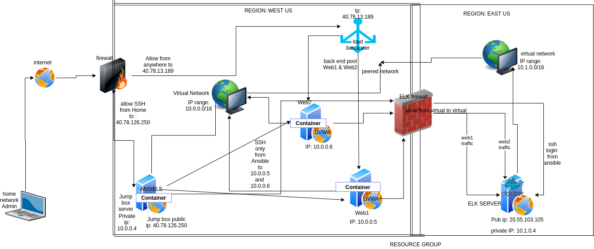
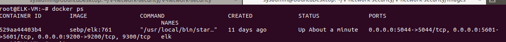

## Automated ELK Stack Deployment

The files in this repository were used to configure the network depicted below.

These files have been tested and used to generate a live ELK deployment on Azure. They can be used to either recreate the entire deployment pictured above. Alternatively, select portions of the playbook file may be used to install only certain pieces of it, such as Filebeat.

Because you are installing filebeat and metricbeat to your Web1 and Web2 servers which will be monitored by the elk server, you need to make changes to both filebeat and metricbeat config files . Below is the link to the changes you need to make in the file in order to enable the elk server collect data from Web1 and Web2 servers. 

##### This document contains the following details:
- Description of the Topologu
- Access Policies
- ELK Configuration
  - Beats in Use
  - Machines Being Monitored
- How to Use the Ansible Build

### Description of the Topology

The main purpose of this network is to expose a load-balanced and monitored instance of DVWA, the Damn Vulnerable Web Application.
###### Below is the playbook of how i installed and deployed the DVWA  to my web1 and Web2 VMs from my Jump box using ansible. 

Load balancing ensures that traffic coming into the website are evenly distributed across multiple servers behind it, in addition to restricting public access directly to the network.
- Load balancers provides another level of security to webservers by providing a website an external IP address that is accessed by the internet. The load balancer receives any traffic that comes into the website and distributes it across multiple servers which also could help to mitigate DoS attacks. One advantage of the Jump box is that It controls access to other machines "webservers" by allowing connections from specific IP addresses and forwarding to those machines, using ssh key to access the jump box is another advantage.

Integrating an ELK server allows users to easily monitor the vulnerable VMs for changes to the files and system logs.
- Filebeat helps generate and organize log files to send to Logstash and Elasticsearch. Specifically, it logs information about the file system, including which files have changed and when
- Metricbeat is extremely easy to use which allows you to monitor your system and the processes running on it.

The configuration details of each machine may be found below.
_Note: the tables below were generated using [Markdown Table Generator](http://www.tablesgenerator.com/markdown_tables) to add/remove values from the table_.

| Name     | Function      | Ip address              | operating system |
|----------|---------------|-------------------------|------------------|
| Jump box | Gateway       | 40.78.126.250  10.0.0.4 | linux            |
| Web1     | DVWA          | 10.0.0.5                | Linux            |
| Web2     | DVWA          | 10.0.0.6                | Linux            |
| Elk      | ElK Server    | 20.55.103.105  10.1.0.4 | Linux            |
| LBT      | Load Balancer | 40.78.13.189            |                  |

### Access Policies

The machines on the internal network are not exposed to the public Internet. 

Only the Jump box machine can accept connections from the Internet. Access to this machine is only allowed from the following IP addresses:
- 76.66.108.155, 74.66.109.543 

Machines within the network can only be accessed by Machines on the internal network.
- You can only access the elk machine from within the ansible container in the jump box "ip address 10.0.0.4" via ssh login. 

A summary of the access policies in place can be found in the table below.

| Name              | Publicly accessible | allowed Ip Addresses         |
|-------------------|---------------------|------------------------------|
| Jump box          | Yes, via SSH        | 76.66.108.155, 74.66.109.543 |
| Web1/DVWA         | No                  | 10.0.0.4                     |
| Web2/DVWA         | No                  | 10.0.0.4                     |
| Elk Server        | No                  | 10.0.0.4                     |
| LBT/Load Balancer | Yes                 | Internet                     |

### Elk Configuration

Ansible was used to automate configuration of the ELK machine. No configuration was performed manually, which is advantageous because...
- In the event that there was a breach or disaster and the system got compromised, you can easily reuse the playbook to redeploy programs or run update on a system. It also helps to avoid time wasting on having to type every code or commands manually anytime you need to make changes or update the system. Ansible playbook can automate all of these tasks in one shot.

###### The playbook implements the following tasks:

-  Configures Elk VM with Docker
-  Installs docker
-  Installs python3-pip
-  Increases virtual memory
-  Download and launches a docker elk container
-  Creates docker images

##### below is the complete playbook file to automate configuration of the ELK machine:

    
The following screenshot displays the result of running `docker ps` after successfully configuring the ELK instance.

### Target Machines & Beats
This ELK server is configured to monitor the following machines:
-   10.0.0.5
-   10.0.0.6

We have installed the following Beats on these machines:
-   filebeat
-   metricbeat

These Beats allow us to collect the following information from each machine:
-  Filebeat collects and monitors all system log files e.g, failed auth logs which can be used to determine how many failed login attempts has been recorded and the location these attempts were made.
-  Metricbeat monitors the health of the system and collects infomation such as e.g, System memory usage which can be used to determine how much space a system has left, etc. 

### Using the Playbook
In order to use the playbook, you will need to have an Ansible control node already configured. Assuming you have such a control node provisioned: 

SSH into the control node and follow the steps below:
- Copy the /etc/ansible/filebeat-config.yml file to  /etc/filebeat/filebeat.yml
- Update the filebeat.yml file to include...
- Run the playbook, and navigate to the destination machine or server to check that the installation worked as expected.

_TODO: Answer the following questions to fill in the blanks:_
- _Which file is the playbook? ANS= YAML file.  Where do you copy it? ANS= from /etc/ansible/
- _Which file do you update to make Ansible run the playbook on a specific machine? ANS= the Yaml file you created.   How do I specify which machine to install the ELK server on versus which to install Filebeat on? ANS= for elk you specify it this way in your yaml file, hosts: elkservers while for the filebeat is also similar, host: webservers 
- _Which URL do you navigate to in order to check that the ELK server is running? ANS= 20.55.103.105:5601

_As a **Bonus**, provide the specific commands the user will need to run to download the playbook, update the files, etc._
